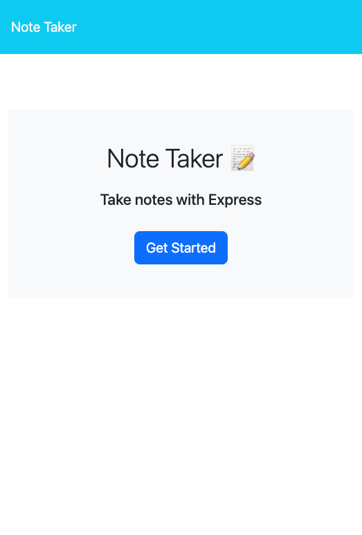
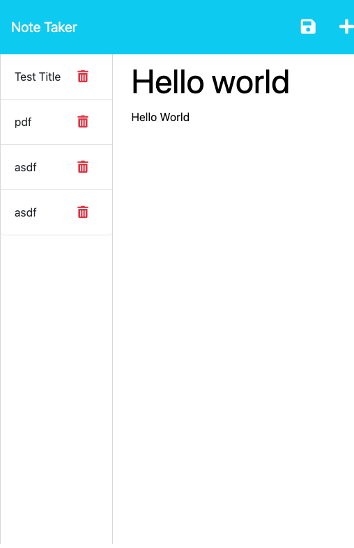

# Note-Taker

This project is a application that can be used to take notes for whenever you need to do so on whatever topic you want. This application uses Express.js backend that saves data to the JSON file and retrieves it as well.

## Built With
-HTML
-CSS
-JavaScript
-Node.js
-Express.js

## Install

Clone project.
Then run the following code in the terminal to install the packages needed.
```
npm i
```

## Usage

After installimg the packages run the terminal and type the following code
```
npm start
```
This will run the server on your local host and to access it hover over the link on the terminal and use the command button to click the link to go to the application. To close the server type control + c on the terminal.

## Screen Shots


